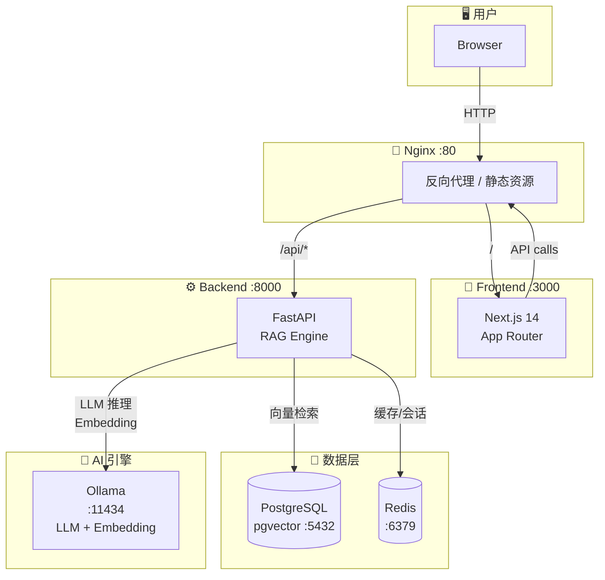

# MindVault 🗃️

> **Mind (智能/知识引擎) + Vault (私有安全存储)**  
> **本地私有化 RAG (检索增强生成) 知识库大模型问答原型系统**

MindVault 是一款专为本地私有化部署设计的 RAG 知识库问答原型系统。本项目使用现代前端技术栈构建，专注于高保真 UI/UX 体验、极致的交互细节、以及平滑的多模态视觉表达，为用户提供类 Dify/AnythingLLM 的专业私有知识库管理与 AI 智能对话体验。

---

## 🚀 核心特性与原型展示

本项目已在前端完整实现并模拟了 RAG 系统的全链路核心交互流程：

### 1. 💬 对话沙盒 (Dialog Arena)
- **多会话管理**：支持动态创建、重命名、删除多个独立的对话会话（如“系统架构讨论”、“技术调研”等）。
- **智能打字机流式响应**：模拟真实大模型的流式文本返回效果，并配有呼吸感十足的骨架屏（Loading Skeletons）加载动画。
- **引用溯源 (Citations)**：回答中可包含点击式的引用标签（如 `[1]`, `[2]`）。点击后，将从右侧平滑滑出 **引用抽屉 (Citation Drawer)**，直观展示参考文档片段、所属源文件、页码以及向量检索相似度。
- **快捷问答模板**：提供一键填充的预设常用问答，方便快速测试对话流。

### 2. 📚 知识库管理中心 (Knowledge Hub)
- **全局仪表盘**：卡片式网格直观展示当前所有知识库、关联文档总数、字符总字数及创建时间等元数据。
- **拖拽式文件上传**：高保真设计的拖拽上传区，完美模拟文件解析、切片（Chunking）到存入向量库的异步流水线，并伴有精致的动态加载进度条。
- **文档生命周期管理**：列表化展示已上传的文档，支持针对单个文档进行“重新解析”与“物理删除”交互。
- **分屏检索沙盒 (Retrieval Sandbox)**：采用高效的分屏/分栏设计。输入检索词后，左侧展现多路召回的向量检索片段与相似度评分（Similarity Score），右侧同步渲染大模型基于该召回片段生成的整合解答。

### 3. 🖥️ 系统诊断与自适应布局 (Diagnostic Sidebar)
- **自适应响应式侧边栏**：左侧经典的专业导航侧边栏，支持移动端自适应折叠、手势遮罩与展开。
- **实时系统监控面板**：直观展示模拟的本地硬件算力负载（如 Apple Silicon 芯片负载）、内存占用曲线、大模型（如 `Qwen-2.5-7B`）的在线运行状态，契合私有化部署的产品定位。

---

## 🛠️ 技术栈选型

- **前端框架**：[Next.js 14 (App Router)](https://nextjs.org/) — 提供极佳的页面路由体验与组件化开发能力。
- **样式引擎**：[TailwindCSS](https://tailwindcss.com/) — 保证高保真设计稿的高效、精确还原与模块化。
- **开发语言**：[TypeScript](https://www.typescript.org/) — 全程类型安全约束，极力避免运行时异常。
- **图标库**：[Lucide React](https://lucide.dev/) — 精美、轻量的像素级统一图标体系。

---

## 📐 系统架构



### 部署拓扑

| 服务 | 端口 | 技术栈 | 用途 |
|------|------|--------|------|
| **Nginx** | 80 | nginx:alpine | 反向代理，路由 `/` 到前端、`/api/*` 到后端，SSE 流式免缓冲 |
| **Frontend** | 3000 | Next.js 14 | 用户交互界面，SSR/SSG 混合渲染 |
| **Backend** | 8000 | FastAPI + Uvicorn | RAG 核心引擎：文档解析、切片、向量检索、LLM 对话 |
| **PostgreSQL** | 5432 | pgvector/pgvector:pg16 | 文档元数据、切片向量、会话记录，HNSW 索引加速检索 |
| **Redis** | 6379 | redis:7-alpine | 会话缓存、限流计数器 |
| **Ollama** | 11434 | ollama/ollama | 本地 LLM 推理 + Embedding 向量化 |

---

## 🐳 Docker Compose 一键部署

### 前置要求

- Docker Engine 24+ & Docker Compose v2
- 至少 16GB 可用内存（Ollama 模型推理）
- （可选）NVIDIA GPU / Apple Silicon 用于 GPU 加速

### 快速启动

```bash
# 1. 克隆项目
git clone git@github.com:sqking-coke/MindVault.git
cd MindVault

# 2. 配置环境变量
cp .env.example .env
# 编辑 .env：修改 API_KEY 等敏感配置

# 3. 一键启动全部服务
docker compose up -d

# 4. 等待服务就绪后，拉取所需模型
docker exec mindvault-ollama-1 ollama pull qwen3
docker exec mindvault-ollama-1 ollama pull BAAI/bge-large-zh-v1.5

# 5. 验证服务状态
curl http://localhost/api/v1/health

# 6. 浏览器访问
open http://localhost
```

### 服务启动顺序

```
postgres (healthy) ──┐
redis (healthy) ─────┼──▶ backend ──▶ nginx
ollama (healthy) ────┘        │
                               └──▶ frontend ──▶ nginx
```

Backend 容器内的 `entrypoint.sh` 会依次等待 PostgreSQL、Redis、Ollama 就绪后再执行数据库迁移并启动服务。

---

## 💻 开发环境启动

为了确保您可以顺利运行并体验 MindVault 静态原型的所有高保真交互，请按照以下步骤进行环境配置、依赖安装和启动验证。

### 1. 环境准备
确保您的本地系统已安装 `Node.js`（推荐使用 v18.17.0 及以上版本）与 `npm` 包管理工具。
- 验证 Node.js 版本：
  ```bash
  node -v
  ```

### 2. 安装项目依赖
在项目根目录下执行以下命令，快速安装 Next.js、React、TailwindCSS 及其相关依赖：
```bash
npm install
```

### 3. 启动本地开发服务
安装完成后，启动本地开发热更新服务器：
```bash
npm run dev
```
启动成功后，终端将输出：
```text
▲ Next.js 14.2.3
- Local:        http://localhost:3000
```
打开浏览器访问 [http://localhost:3000](http://localhost:3000)，即可进入 MindVault 平台，体验完整的对话、上传、检索和诊断交互！

### 4. 生产构建验证
验证项目在生产环境下的编译与静态路由生成。Next.js 编译器将进行严格的静态分析：
```bash
npm run build
```
编译成功后，将生成高度优化的、预渲染的静态文件，且不含任何警告或错误。

### 5. 代码质量与类型检查
在提交代码前，可以运行以下命令来确保代码质量和 TypeScript 的严谨性：
- **静态代码检查 (Linter)**：
  ```bash
  npm run lint
  ```
- **TypeScript 类型安全性验证**：
  ```bash
  npx tsc --noEmit
  ```

---

## 📁 页面与代码目录结构

为了方便您深入了解前端实现细节，以下是本项目的核心代码目录结构说明：

```text
src/
├── app/
│   ├── globals.css          # 全局样式（Tailwind 指令与自定义动画）
│   ├── layout.tsx           # 全局布局（注入 Context、自适应侧边栏容器）
│   ├── page.tsx             # 仪表盘总览页
│   ├── chat/
│   │   └── page.tsx         # 对话沙盒 (Dialog Arena) 交互核心页面
│   └── kb/
│       └── page.tsx         # 知识库管理中心与检索沙盒主页面
├── components/
│   ├── chat/
│   │   └── CitationDrawer.tsx  # 滑出式引用溯源抽屉组件
│   └── layout/
│       └── Sidebar.tsx      # 系统诊断侧边栏（包含 CPU、内存、模型状态面板）
└── context/
    └── MindVaultContext.tsx # 共享状态管理（模拟会话、文档上传、知识库列表状态）
```

---

## ✨ 设计亮点

- **样式与业务解耦**：所有数据状态（如上传进度、多会话列表、AI 回复内容等）均由 `MindVaultContext` 统一管理，组件仅负责高保真的视觉还原与 UI 交互，为后续的后端接口真实联调打下了完美的解耦基础。
- **无外部静态资源依赖**：所有的图标、动画均由 SVG 与纯 CSS/Tailwind 构成，不依赖外部 CDN 或未打包静态图，保证离线、私有局域网环境下 100% 完美呈现。
