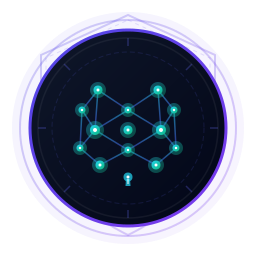
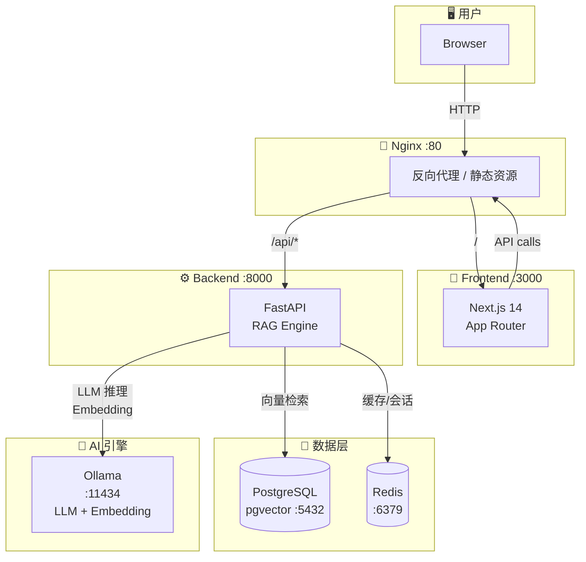

<p align="center">
  
</p>

<h1 align="center">mindvaults</h1>
<p align="center">mindvaults = AI 知识库（Mind）+ 私有保险库（Vault），本地/云端双模式 RAG 问答系统，你的数据永远归你所有。</p>


<p align="center">
  
  
  
  
  
  <br/>
  
  
  
  
  
  
  
</p>

---

> mindvaults 是一款支持**本地私有化 + 云端 API 双模式**的 RAG 知识库问答系统。提供两套部署方案：轻量模式（4 容器，~1.5GB，LLM/Embedding 走云端 API）和全栈模式（6 容器，Ollama 本地推理，数据完全不出网）。基于 FastAPI + Next.js 14 + PostgreSQL/pgvector + Redis 构建。

## 🚀 核心特性

### 1. 💬 RAG 智能问答
- **语义检索**：pgvector HNSW 索引 + BGE-large-zh-v1.5 向量化，精准匹配私有知识
- **SSE 流式响应**：实时 token 推送 + 打字机效果，progress 事件透明展示意图识别→检索→匹配→生成全链路
- **多轮对话**：session_id 关联会话记忆，支持上下文连续答疑
- **意图识别**：自动分类用户查询意图（知识问答/文档检索/闲聊），适配不同回答策略
- **引用溯源 (Citations)**：答案附带原文片段 + 文档来源 + 相似度评分 + PDF 页码，点击引用角标弹出 CitationDrawer 查看完整原文

### 2. 📚 知识库管理
- **多格式文档导入**：支持 TXT/MD/PDF/Word 文件上传，自动解析、切片、向量化入库
- **批量上传**：拖拽式上传区 + 异步摄入管道（解析→切片→向量化→入库），实时进度展示
- **文档生命周期管理**：文档列表分页查看、软删除、启用/禁用、增量重索引
- **切片管理**：按文档查看切片列表，支持编辑切片内容（自动重向量化）和删除切片
- **检索沙盒**：分屏检索测试，输入查询词 → 返回 Top-K 匹配片段 + 相似度评分

### 3. 🛠️ 知识库运维（P2）
- **运维管理面板** (`/kb/ops`)：文档启用/禁用切换、重索引、切片查看/编辑/删除
- **问答复盘统计** (`/kb/stats`)：高频问题 Top-N、无答案问题列表、知识库概览卡片
- **Redis 检索缓存**：高频查询结果缓存（TTL 1h），不可用时自动降级至直接查库
- **增量向量更新**：文档重索引 API，删除旧切片 → 重新解析 → 向量化 → 写入，异步完成

### 4. 🎨 高级溯源与内容运营（P2）
- **PDF 双屏联动高亮**：引用来源于 PDF 时，CitationDrawer 内嵌 pdf.js 预览，自动翻页至对应页码，引用文本 CSS overlay 高亮
- **微信公众号排版适配**：inline-CSS 转换器，一键复制精美问答卡片到公众号编辑器，适配微信生态安全色与中文字体栈

### 5. 🔒 安全与运维
- **API Key 鉴权**：`Authorization: Bearer <API_KEY>` 保护所有 API 端点
- **限流控制**：问答接口 30次/分钟，上传接口 10次/分钟（可配置）
- **日志轮转**：loguru 结构化日志，每天午夜轮转，保留 30 天
- **Docker Compose 一键部署**：前端 + 后端 + PostgreSQL + Redis + Ollama + Nginx

---

## 🛠️ 技术栈

| 层面 | 技术 | 说明 |
|------|------|------|
| **前端** | Next.js 14 (App Router) + TypeScript + TailwindCSS | SSR/SSG 混合渲染，lucide-react 图标 |
| **后端** | FastAPI + Uvicorn | Python 异步框架，自动生成 OpenAPI 文档 |
| **数据库** | PostgreSQL 16 + pgvector | 业务数据 + 向量存储统一管理，HNSW 索引 |
| **缓存** | Redis | 高频检索结果缓存 |
| **ORM** | SQLAlchemy 2.0 + asyncpg | 异步数据库驱动 |
| **LLM** | Ollama (qwen3) / 云端 API | 支持 ollama/openai provider 切换，可选用 DeepSeek/OpenAI/通义千问 |
| **Embedding** | BGE-large-zh-v1.5 / 云端 API | 支持 ollama/openai provider 切换，自动适配向量维度 |
| **文档解析** | PyPDF2, python-docx, markdown | 多格式文档内容提取 |
| **部署** | Docker Compose + Nginx | 轻量 4 容器 / 全栈 6 容器 双模式 |

---

## 📐 系统架构



### 部署拓扑

| 服务 | 端口 | 技术栈 | 用途 |
|------|------|--------|------|
| **Nginx** | 80 | nginx:alpine | 反向代理，路由 `/` 到前端、`/api/*` 到后端，SSE 流式免缓冲 |
| **Frontend** | 3000 | Next.js 14 | 用户交互界面 |
| **Backend** | 8000 | FastAPI + Uvicorn | RAG 核心引擎：文档解析、切片、向量检索、LLM 对话 |
| **PostgreSQL** | 5432 | pgvector/pgvector:pg16 | 文档元数据、切片向量、会话记录、Q&A 记录，HNSW 索引 |
| **Redis** | 6379 | redis:7-alpine | 检索结果缓存、限流计数器 |
| **Ollama** | 11434 | ollama/ollama | 本地 LLM 推理 + Embedding 向量化 |

---

## 📡 API 接口

所有接口以 `/api/v1` 为前缀，需要 `Authorization: Bearer <API_KEY>` 鉴权（health 除外）。

### 文档管理
| 方法 | 路径 | 说明 |
|------|------|------|
| POST | `/api/v1/kb/documents` | 批量上传文档（multipart/form-data） |
| GET | `/api/v1/kb/documents` | 分页查询文档列表 |
| GET | `/api/v1/kb/documents/{id}` | 获取文档详情 |
| PUT | `/api/v1/kb/documents/{id}` | 更新文档名称/描述 |
| DELETE | `/api/v1/kb/documents/{id}` | 软删除文档 |
| PUT | `/api/v1/kb/documents/{id}/status` | 切换文档启用/禁用 |
| POST | `/api/v1/kb/documents/{id}/reindex` | 增量重索引 |

### 智能问答
| 方法 | 路径 | 说明 |
|------|------|------|
| POST | `/api/v1/kb/chat` | RAG 问答（SSE 流式响应） |
| GET | `/api/v1/kb/chat/history` | 会话问答历史（分页） |
| GET | `/api/v1/kb/chat/sessions` | 会话列表 |

### 检索与切片
| 方法 | 路径 | 说明 |
|------|------|------|
| POST | `/api/v1/kb/retrieval/test` | 检索测试沙盒 |
| GET | `/api/v1/kb/chunks/{id}/preview` | 切片预览 |
| POST | `/api/v1/kb/chunks/{id}/locate` | 切片定位（页码+偏移量+高亮锚点） |
| GET | `/api/v1/kb/documents/{id}/chunks` | 文档切片列表 |
| PUT | `/api/v1/kb/chunks/{id}` | 编辑切片（自动重向量化） |
| DELETE | `/api/v1/kb/chunks/{id}` | 删除切片 |

### 问答复盘统计
| 方法 | 路径 | 说明 |
|------|------|------|
| GET | `/api/v1/kb/stats/overview` | 知识库运维概览 |
| GET | `/api/v1/kb/stats/frequent-questions` | 高频问题 Top-N |
| GET | `/api/v1/kb/stats/unanswered` | 无答案问题列表 |

### 健康检查
| 方法 | 路径 | 说明 |
|------|------|------|
| GET | `/api/v1/health` | 服务健康检查（无需鉴权） |

---

## 🐳 部署指南

mindvaults 提供**轻量（云端 API）** 和**本地全栈（Ollama）** 双模式部署，并支持开发环境手动构建。

> 📖 完整部署文档请参阅 **[docs/DEPLOYMENT_GUIDE.md](docs/DEPLOYMENT_GUIDE.md)**，涵盖：
> - Docker Compose 一键部署（轻量 / 全栈）
> - 24 项环境变量详解 + 4 种 Provider 组合方案
> - 云服务器初始化 + Nginx HTTPS + 安全加固清单
> - 8 个典型故障排查场景
> - 开发环境手动构建 + 代码质量检查

---

## 🎨 品牌视觉与变体

mindvaults 精心设计了三款不同风格的高精细度 **SVG 矢量品牌徽标 (Logo)**，完全适配暗黑/明亮模式以及移动端自适应。

> 🎨 完整设计规范与多模态素材，请参阅 **[docs/BRANDING_GUIDE.md](docs/BRANDING_GUIDE.md)**，包含：
> - **Option A (默认)**: Cyber RAG Vault (赛博大脑与密码锁)
> - **Option B**: Minimalist Monogram (极简 MV 向量交织丝带)
> - **Option C**: Enterprise Shield (企业级高主权高防卫盾牌)
> - **微信公众号排版规范** (次图尺寸、首图 Banner 及微信安全调色板)
> - **网页 Favicon 转换及 Web App Manifest 配置指引**

---

## 📁 代码目录结构

```text
mindvaults/
├── backend/
│   ├── app/
│   │   ├── main.py                 # FastAPI 应用入口
│   │   ├── config.py               # 环境变量配置
│   │   ├── api/
│   │   │   ├── deps.py             # 依赖注入（DB/鉴权）
│   │   │   └── v1/
│   │   │       ├── router.py       # 路由注册
│   │   │       ├── chat.py         # 问答 SSE 端点
│   │   │       ├── documents.py    # 文档 CRUD 端点
│   │   │       ├── retrieval.py    # 检索测试 + 切片预览
│   │   │       ├── chunks.py       # 切片管理端点
│   │   │       ├── stats.py        # 问答复盘统计端点
│   │   │       └── health.py       # 健康检查
│   │   ├── models/                 # SQLAlchemy 数据模型
│   │   │   ├── document.py         # KbDocument
│   │   │   ├── chunk.py            # KbChunk (含 pgvector)
│   │   │   ├── session.py          # KbSession
│   │   │   ├── qa_record.py        # KbQaRecord
│   │   │   └── config.py           # KbConfig
│   │   ├── schemas/                # Pydantic 请求/响应模型
│   │   ├── services/               # 业务逻辑层
│   │   │   ├── chat_service.py     # RAG 问答 + 意图识别
│   │   │   ├── document_service.py # 文档管理 + 重索引
│   │   │   ├── retrieval_service.py# pgvector 向量检索
│   │   │   ├── ingestion_service.py# 摄入管道编排
│   │   │   ├── parser_service.py   # 文档解析（PDF/Word/MD）
│   │   │   ├── chunking_service.py # 文本切片（固定/语义）
│   │   │   ├── embedding_service.py# BGE 向量生成
│   │   │   ├── llm_service.py      # Ollama LLM 调用
│   │   │   ├── cache_service.py    # Redis 缓存
│   │   │   ├── stats_service.py    # 问答统计聚合
│   │   │   └── chunk_service.py    # 切片 CRUD
│   │   └── core/
│   │       ├── database.py         # 异步数据库引擎
│   │       ├── redis.py            # Redis 连接管理
│   │       ├── middleware.py        # 限流 + 请求日志
│   │       └── exceptions.py       # 全局异常处理器
│   └── tests/                      # pytest 测试套件
├── src/
│   ├── app/
│   │   ├── layout.tsx              # 全局布局（Sidebar + Context）
│   │   ├── page.tsx                # 首页仪表盘
│   │   ├── chat/page.tsx           # 对话页
│   │   └── kb/
│   │       ├── page.tsx            # 知识库管理主页
│   │       ├── ops/page.tsx        # 运维管理面板
│   │       └── stats/page.tsx      # 问答复盘统计看板
│   ├── components/
│   │   ├── chat/
│   │   │   ├── ChatMessageList.tsx  # 消息流 + 打字机效果
│   │   │   ├── ChatInputArea.tsx    # 输入框 + 快捷模板
│   │   │   ├── CitationDrawer.tsx   # 引用溯源抽屉（PDF联动）
│   │   │   ├── KnowledgeCard.tsx    # 知识卡片生成
│   │   │   └── WechatExport.tsx     # 公众号排版导出
│   │   ├── kb/
│   │   │   ├── KBDashboard.tsx      # 知识库概览卡片网格
│   │   │   ├── DocumentTable.tsx    # 文档列表 + 操作
│   │   │   ├── UploadZone.tsx       # 拖拽文件上传
│   │   │   ├── RetrievalSandbox.tsx # 检索测试分屏
│   │   │   ├── KBOpsPanel.tsx       # 运维管理面板
│   │   │   ├── KBStatsPanel.tsx     # 统计面板容器
│   │   │   ├── ChunkList.tsx        # 切片列表
│   │   │   ├── ChunkEditor.tsx      # 切片编辑器
│   │   │   ├── FrequentQuestions.tsx# 高频问题表格
│   │   │   ├── UnansweredList.tsx   # 无答案问题列表
│   │   │   └── OverviewCards.tsx    # 概览统计卡片
│   │   └── layout/
│   │       └── Sidebar.tsx          # 自适应导航侧边栏
│   ├── services/
│   │   ├── apiClient.ts            # API 调用封装
│   │   ├── ragService.ts           # RAG 服务层
│   │   ├── intentRouter.ts         # 意图路由配置
│   │   └── mockRagService.ts       # Mock 数据（开发用）
│   ├── context/
│   │   └── mindvaultsContext.tsx     # 全局状态管理
│   ├── types/
│   │   └── api.ts                  # TypeScript API 类型定义
│   └── utils/
│       └── wechatFormat.ts         # 公众号 inline-CSS 转换器
├── docker-compose.yml              # Docker Compose 编排
├── nginx.conf                      # Nginx 反向代理配置
├── Dockerfile.frontend             # 前端 Docker 构建
├── CLAUDE.md                       # 项目 AI Agent 指南
├── docs/planning/                  # 分阶段规划文档 (P0/P1/P2)
├── task_plan.md                    # 当前阶段任务规划
├── findings.md                     # 技术研究发现
└── progress.md                     # 进度日志
```

---

## ✨ 设计亮点

- **纯本地闭环**：所有文档、向量数据、问答记录全部本地存储，零外网上传，保障数据隐私安全
- **先文档后编码**：每个阶段（P0/P1/P2）遵循 规划→拆分→分配→文档→确认→实施 工作流，规划文档 7+ 份
- **SSE 全链路透传**：意图识别→检索→匹配→生成 四阶段 progress 事件，透明展示 RAG 底层处理链路
- **Redis 降级策略**：缓存不可用时自动降级至直接查询 pgvector，不影响核心问答功能
- **零 schema migration 扩展**：P2 新增文档禁用/统计/缓存等 8 项能力，零新表、零改列
- **多 Agent 协同开发**：Claude (后端) + Gemini (前端) 并行推进，Multica 统筹协调，3-4 天完成完整阶段交付
