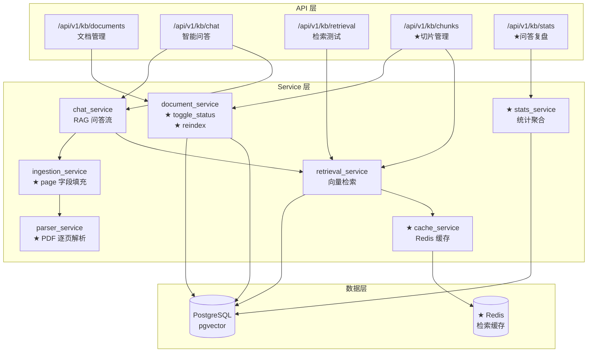
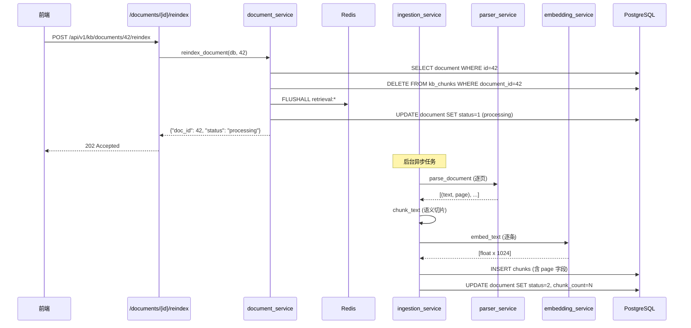
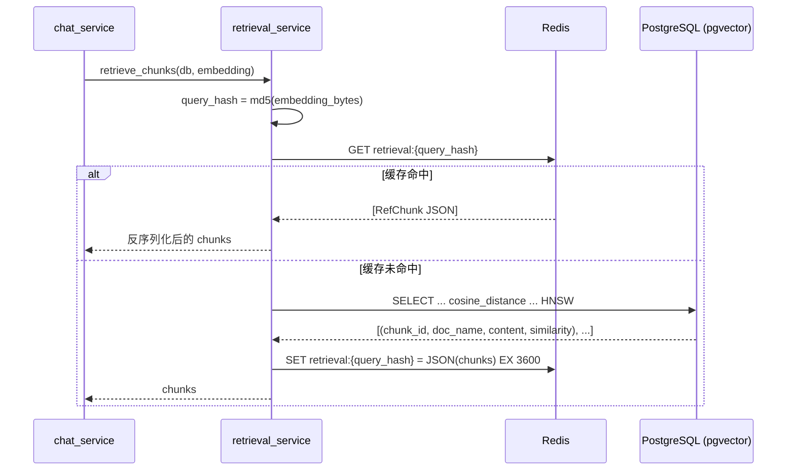

# P2-02 - 后端架构设计

> P2 阶段后端新增模块的详细架构设计，含组件图、数据流图和 Mermaid 架构图。

## 1. 当前 P1 后端架构（基线）

```
backend/app/
├── main.py                    # FastAPI 应用入口 + lifespan + 日志
├── config.py                  # Pydantic Settings (环境变量)
├── api/
│   ├── deps.py                # get_db + verify_api_key 依赖注入
│   └── v1/
│       ├── router.py          # 路由注册（/api/v1/kb/...）
│       ├── health.py          # GET /api/v1/health
│       ├── documents.py       # 文档 CRUD
│       ├── chat.py            # 问答 SSE + 历史 + 会话
│       └── retrieval.py       # 检索测试 + chunk preview/locate
├── models/
│   ├── __init__.py            # Base = DeclarativeBase
│   ├── document.py            # KbDocument (status: 0/1/2)
│   ├── chunk.py               # KbChunk (含 page 字段)
│   ├── session.py             # KbSession
│   ├── qa_record.py           # KbQaRecord (含 ref_chunks JSONB)
│   └── config.py              # KbConfig (单行配置)
├── schemas/
│   ├── common.py              # success_response, PaginatedData
│   ├── document.py            # 文档请求/响应模型
│   ├── chat.py                # 问答请求/响应模型
│   └── retrieval.py           # 检索测试请求/响应模型
├── services/
│   ├── parser_service.py      # 文档解析（PyPDF2, docx, markdown）
│   ├── chunking_service.py    # 文本切片（固定/语义双模式）
│   ├── embedding_service.py   # 向量生成（BGE 模型）
│   ├── retrieval_service.py   # pgvector HNSW 检索 + 配置读取
│   ├── ingestion_service.py   # 后台摄入管道编排
│   ├── document_service.py    # 文档 CRUD 业务逻辑
│   ├── chat_service.py        # RAG 问答流式 + 意图识别
│   └── llm_service.py         # 大模型调用（OpenAI 兼容 API）
└── core/
    ├── database.py            # async engine + session factory
    ├── middleware.py           # slowapi 限流 + 请求日志
    └── exceptions.py          # 全局异常类 + 处理器
```

## 2. P2 新增/修改模块

```
backend/app/
│
├── api/v1/
│   ├── stats.py               ★ NEW: 问答统计 + 运维仪表盘 API
│   └── chunks.py              ★ NEW: 切片 CRUD API（从 retrieval.py 拆出增强）
│
├── models/
│   └── document.py            ★ MODIFY: 新增 DOC_STATUS_DISABLED=3
│
├── schemas/
│   ├── stats.py               ★ NEW: 统计请求/响应模型
│   └── retrieval.py           ★ MODIFY: 新增 ChunkUpdateRequest
│
├── services/
│   ├── cache_service.py       ★ NEW: Redis 缓存客户端封装
│   ├── stats_service.py       ★ NEW: 问答统计聚合查询
│   ├── retrieval_service.py   ★ MODIFY: 集成 Redis 缓存读写
│   ├── parser_service.py      ★ MODIFY: PDF 逐页解析保留页码
│   ├── ingestion_service.py   ★ MODIFY: chunk 写入时填充 page 字段
│   └── document_service.py    ★ MODIFY: 新增 toggle_status, reindex_document
│
└── core/
    └── redis.py               ★ NEW: Redis 连接管理（async）
```

## 3. P2 模块架构图



## 4. 核心新增模块详细设计

### 4.1 Redis 缓存服务 (`cache_service.py`)

```python
# 设计要点
class CacheService:
    """Redis 检索结果缓存"""
    
    async def get_retrieval(redis, query_hash: str) -> list[RefChunk] | None:
        """按 query embedding hash 读取缓存"""
        ...
    
    async def set_retrieval(redis, query_hash: str, chunks: list[RefChunk], ttl: int = 3600):
        """写入缓存，TTL 默认 1 小时"""
        ...
    
    async def invalidate_document(redis, doc_id: int):
        """文档更新/重索引后，清除相关缓存（pattern: retrieval:*）"""
        ...
```

**缓存 Key 设计**:
- 格式: `retrieval:{md5(embedding_bytes)}`
- TTL: 3600 秒（环境变量 `REDIS_CACHE_TTL`）
- 序列化: JSON (通过 RefChunk.model_dump())

**集成点**: `retrieval_service.retrieve_chunks()` — 检索前先查缓存，命中则直接返回；miss 则查 pgvector 后写缓存

### 4.2 PDF 逐页解析 (`parser_service.py` 改动)

```python
# 当前逻辑: 整个 PDF 一次读完，返回纯文本
# P2 改动: 逐页读取，返回 (text: str, pages: list[int]) 或 list[tuple[str, int]]

async def parse_document(file_path: str, doc_type: str) -> list[tuple[str, int | None]]:
    """
    解析文档返回 (content, page_number) 列表。
    PDF 格式返回带页码的列表，其他格式 page=None。
    """
    ...
```

**ingestion_service 改动**: 
- 切片时记录每个 chunk 对应的页码（取 chunk 中第一个 token 的 page 序号）
- 写入 KbChunk 时填充 `page` 字段

### 4.3 增量重索引 (`document_service.reindex_document`)

```python
async def reindex_document(db, doc_id: int) -> dict:
    """文档重索引：删除旧 chunks → 重新走摄入管道"""
    # 1. 校验文档存在且未软删除
    # 2. 删除所有旧 KbChunk (WHERE document_id=doc_id)
    # 3. 清除 Redis 相关缓存
    # 4. 更新文档状态为 PROCESSING
    # 5. 调度后台摄入
    # 6. 返回 {"doc_id": doc_id, "status": "processing"}
```

### 4.4 问答统计服务 (`stats_service.py`)

```python
async def get_frequent_questions(db, top_n: int = 10) -> list[FrequentQuestion]:
    """高频问题 Top-N：按 question 前缀聚类 + count 降序"""
    # 伪 SQL: 
    # SELECT LEFT(question, 50) as q, COUNT(*) as cnt 
    # FROM kb_qa_records 
    # GROUP BY LEFT(question, 50) 
    # ORDER BY cnt DESC LIMIT :top_n

async def get_unanswered_questions(db, page, page_size) -> PaginatedData:
    """无答案问题：ref_chunks 为空数组的 QA 记录"""

async def get_kb_overview(db) -> KbOverview:
    """知识库概览：文档总数、切片总数、QA 总数、存储量估算"""
```

## 5. 数据流: P2 增量重索引



## 6. 数据流: Redis 缓存命中


