# P2-03 - 前端设计

> P2 阶段前端新增页面、组件和数据交互的详细设计。

## 1. 新增页面路由

```
src/app/
├── kb/
│   ├── page.tsx               # 已有: 知识库管理主页
│   ├── ops/
│   │   └── page.tsx           # ★ NEW: 知识库运维管理页 /kb/ops
│   └── stats/
│       └── page.tsx           # ★ NEW: 问答复盘统计页 /kb/stats
└── chat/
    └── page.tsx               # 已有: 增强 CitationDrawer PDF 联动
```

## 2. 新增组件树

```
src/components/
├── kb/
│   ├── KBDashboard.tsx        # 已有: 知识库卡片网格
│   ├── DocumentTable.tsx      # ★ 增强: 增加启用/禁用切换、重索引按钮
│   ├── UploadZone.tsx         # 已有
│   ├── RetrievalSandbox.tsx   # 已有
│   ├── KBOpsPanel.tsx         # ★ NEW: 运维管理面板
│   │   ├── ChunkList.tsx      # ★ NEW: 切片列表（按文档查看）
│   │   ├── ChunkEditor.tsx    # ★ NEW: 切片编辑器（modal）
│   │   └── ReindexButton.tsx  # ★ NEW: 重索引操作按钮
│   └── KBStatsPanel.tsx       # ★ NEW: 问答复盘统计面板
│       ├── FrequentQuestions.tsx  # ★ NEW: 高频问题 Top-10
│       ├── UnansweredList.tsx     # ★ NEW: 无答案问题列表
│       └── OverviewCards.tsx      # ★ NEW: 知识库概览卡片
├── chat/
│   ├── ChatMessageList.tsx    # 已有
│   ├── ChatInputArea.tsx      # 已有
│   ├── CitationDrawer.tsx     # ★ 增强: 嵌入 PDF 预览 + 自动翻页 + 高亮
│   ├── KnowledgeCard.tsx      # 已有 (P1)
│   └── WechatExport.tsx       # ★ NEW: 微信公众号排版导出
├── layout/
│   └── Sidebar.tsx            # ★ 增强: 添加运维/统计导航项
└── shared/
    └── ToggleSwitch.tsx       # ★ NEW: 通用开关组件
```

## 3. 页面设计详述

### 3.1 知识库运维管理页 (`/kb/ops`)

```
┌──────────────────────────────────────────────────────────┐
│  📋 知识库运维管理                                        │
│                                                          │
│  ┌─ 概览卡片 ──────────────────────────────────────────┐ │
│  │  📄 15 文档   🧩 1,247 切片   ❌ 3 禁用   🔄 2 处理中 │ │
│  └────────────────────────────────────────────────────┘ │
│                                                          │
│  ┌─ 文档列表 ──────────────────────────────────────────┐ │
│  │ 文档名称          │类型│切片数│状态    │操作          │ │
│  │────────────────────────────────────────────────── │ │
│  │ 系统架构设计手册   │ md │  42  │✅ 启用  │[禁用][重索引]│ │
│  │ API 接口文档      │ md │  28  │❌ 禁用  │[启用][重索引]│ │
│  │ 运维部署手册      │ pdf│  35  │🔄 处理中│[查看切片]    │ │
│  │ ...              │ .. │  ..  │  ...   │ ...          │ │
│  └────────────────────────────────────────────────────┘ │
│                                                          │
│  ┌─ 切片管理 (点击文档展开) ───────────────────────────┐ │
│  │ # │切片内容预览 (前80字)            │页码│操作        │ │
│  │───┼─────────────────────────────────┼───┼────────────│ │
│  │ 0 │微服务间通过 gRPC 进行同步通信... │ - │[编辑][删除]│ │
│  │ 1 │服务部署采用 Docker Compose...    │ - │[编辑][删除]│ │
│  │ 2 │Nginx 作为反向代理，配置 SSE...   │ - │[编辑][删除]│ │
│  └────────────────────────────────────────────────────┘ │
└──────────────────────────────────────────────────────────┘
```

**交互要点**:
- 启用/禁用切换: 即时 `PUT /api/v1/kb/documents/{id}/status` + Toast 确认
- 重索引: 弹窗确认 → `POST /api/v1/kb/documents/{id}/reindex` → polling 状态直到完成
- 切片编辑: Modal → 编辑 content → `PUT /api/v1/kb/chunks/{id}` → 自动重向量化
- 切片删除: 确认弹窗 → `DELETE /api/v1/kb/chunks/{id}`

### 3.2 问答复盘统计页 (`/kb/stats`)

```
┌──────────────────────────────────────────────────────────┐
│  📊 问答复盘统计                                          │
│                                                          │
│  ┌──────────┐ ┌──────────┐ ┌──────────┐ ┌────────────┐ │
│  │ 📄       │ │ 💬       │ │ 🔥       │ │ ⚡         │ │
│  │ 15       │ │ 328      │ │ 42       │ │ 0.92       │ │
│  │ 文档总数 │ │ 问答总数 │ │ 高频问题 │ │ 平均相似度 │ │
│  └──────────┘ └──────────┘ └──────────┘ └────────────┘ │
│                                                          │
│  ┌─ 高频问题 Top-10 ──────────────────────────────────┐ │
│  │ # │问题                          │次数│最近时间     │ │
│  │───┼──────────────────────────────┼───┼─────────────│ │
│  │ 1 │微服务之间如何通信？          │ 23 │05-29 14:32  │ │
│  │ 2 │Docker Compose 如何配置网络？ │ 18 │05-29 11:05  │ │
│  │ 3 │如何优化 pgvector 检索性能？  │ 15 │05-28 16:20  │ │
│  │...│...                           │...│...          │ │
│  └────────────────────────────────────────────────────┘ │
│                                                          │
│  ┌─ 无答案问题列表 ────────────────────────────────────┐ │
│  │ 问题                          │时间        │操作     │ │
│  │───────────────────────────────┼───────────┼─────────│ │
│  │ Kubernetes 中的 Service Mesh？│05-29 10:15 │[补充知识]│ │
│  │ WebAssembly 在边缘计算的应用？│05-28 17:42 │[补充知识]│ │
│  └────────────────────────────────────────────────────┘ │
└──────────────────────────────────────────────────────────┘
```

**数据流**:
- 概览卡片: `GET /api/v1/kb/stats/overview` — 单次请求返回所有聚合数据
- 高频问题: `GET /api/v1/kb/stats/frequent-questions?top_n=10`
- 无答案问题: `GET /api/v1/kb/stats/unanswered?page=1&page_size=20`
- "补充知识" 按钮: 跳转到上传页面或直接打开上传 Dialog

### 3.3 PDF 双屏联动高亮定位

```
┌───────────────────────────┬─────────────────────────────┐
│  Chat 对话区               │  CitationDrawer (右侧)       │
│                           │                             │
│  用户: 系统的部署架构？    │  📎 引用来源: 运维手册.pdf   │
│                           │  ┌───────────────────────┐  │
│  AI: 根据运维手册，系统    │  │                       │  │
│  采用 Docker Compose 部署  │  │     PDF 预览区域       │  │
│  [1]...                    │  │  ┌─────────────────┐ │  │
│                           │  │  │ ← 自动翻到 P3    │ │  │
│                           │  │  │                   │ │  │
│                           │  │  │ ████████████████ │ │  │
│                           │  │  │ █ 引用文本高亮 █ │ │  │
│                           │  │  │ ████████████████ │ │  │
│                           │  │  │                   │ │  │
│                           │  │  └─────────────────┘ │  │
│                           │  │  相似度: 92%          │  │
│                           │  └───────────────────────┘  │
└───────────────────────────┴─────────────────────────────┘
```

**实现要点**:
- **PDF 渲染**: `pdf.js` (pdfjs-dist) — 轻量级，不依赖后端
- **页码定位**: 从 `ref_chunks[].page` 字段读取页码 → 跳转到对应页
- **文本高亮**: `pdf.js` text layer API → 在对应 page 上定位匹配 text → CSS highlight overlay
- **API 数据源**: `POST /api/v1/kb/chunks/{id}/locate` 返回 `{page, offset, highlight_anchor}`

### 3.4 微信公众号排版适配 (`WechatExport.tsx`)

```
┌──────────────────────────────────────────┐
│  回答内容                                │
│  ...                                     │
│  ┌────────────────────────────────────┐  │
│  │ [📋 复制到微信公众号]              │  │
│  └────────────────────────────────────┘  │
│                                          │
│  复制后粘贴到公众号编辑器中样式的效果:     │
│  ┌────────────────────────────────────┐  │
│  │         知识卡片 (预览)             │  │
│  │  ┌──────────────────────────────┐  │  │
│  │  │ 标题 (18px, #333, bold)      │  │  │
│  │  │ ──────────────────────────── │  │  │
│  │  │ 正文 (15px, #555, 1.75行距)  │  │  │
│  │  │                              │  │  │
│  │  │ • 要点一                     │  │  │
│  │  │ • 要点二                     │  │  │
│  │  │                              │  │  │
│  │  │ 📎 来源: 系统架构设计手册     │  │  │
│  │  │ 🔗 由 mindvaults 生成         │  │  │
│  │  └──────────────────────────────┘  │  │
│  └────────────────────────────────────┘  │
└──────────────────────────────────────────┘
```

**实现方案**:
- **inline-CSS 适配器**: 将 Tailwind class → 内联 style（公众号不支持 class）
- **字体**: `system-ui, -apple-system, PingFang SC, Microsoft YaHei`（跨平台中文字体栈）
- **颜色**: 公众号兼容色板（`#333`, `#555`, `#888`, `#1a6fc4` 链接蓝）
- **图片**: 可选 `html2canvas` 导出为图片卡片（类似 KnowledgeCard 但适配公众号宽度 900px）

## 4. 组件增强: CitationDrawer PDF 联动

```typescript
// 伪代码: CitationDrawer 增强
interface CitationDrawerProps {
  chunks: RefChunk[];  // {chunk_id, doc_name, content, similarity, page}
  activeChunkId: number | null;
}

// 当 chunk 来源为 PDF (page !== null):
// 1. 加载 pdf.js worker
// 2. 渲染 PDF 到 Canvas
// 3. 跳转至 chunk.page 对应页
// 4. 在 text layer 中匹配 chunk.content 前 100 字符
// 5. 添加高亮 overlay

// 数据刷新建言: 
// - 首次展开 Drawer 时调用 GET /api/v1/kb/chunks/{id}/preview 获取完整内容
// - 调用 POST /api/v1/kb/chunks/{id}/locate 获取精确页码和高亮锚点
```

## 5. 前端数据流图

```mermaid
graph TD
    subgraph "页面"
        OPS["/kb/ops<br/>运维管理页"]
        STATS["/kb/stats<br/>统计看板页"]
        CHAT["/chat<br/>增强: PDF联动"]
    end

    subgraph "API Client (apiClient.ts)"
        GET_DOCS["GET /documents"]
        PUT_STATUS["PUT /documents/:id/status"]
        POST_REINDEX["POST /documents/:id/reindex"]
        GET_CHUNKS["GET /documents/:id/chunks"]
        PUT_CHUNK["PUT /chunks/:id"]
        DELETE_CHUNK["DELETE /chunks/:id"]
        GET_OVERVIEW["GET /stats/overview"]
        GET_FREQ["GET /stats/frequent-questions"]
        GET_UNANSWERED["GET /stats/unanswered"]
        GET_LOCATE["POST /chunks/:id/locate"]
    end

    subgraph "组件"
        DOC_TABLE["DocumentTable<br/>★增强: 禁用/重索引"]
        CHUNK_LIST["ChunkList<br/>★NEW: 切片管理"]
        CHUNK_EDITOR["ChunkEditor<br/>★NEW: 编辑modal"]
        FREQ_TABLE["FrequentQuestions<br/>★NEW"]
        UNANSWERED["UnansweredList<br/>★NEW"]
        OVERVIEW["OverviewCards<br/>★NEW"]
        CITATION["CitationDrawer<br/>★增强: PDF预览"]
    end

    OPS --> GET_DOCS
    OPS --> PUT_STATUS
    OPS --> POST_REINDEX
    OPS --> GET_CHUNKS
    OPS --> PUT_CHUNK
    OPS --> DELETE_CHUNK
    OPS --> DOC_TABLE
    OPS --> CHUNK_LIST
    OPS --> CHUNK_EDITOR

    STATS --> GET_OVERVIEW
    STATS --> GET_FREQ
    STATS --> GET_UNANSWERED
    STATS --> OVERVIEW
    STATS --> FREQ_TABLE
    STATS --> UNANSWERED

    CHAT --> GET_LOCATE
    CHAT --> CITATION
```


