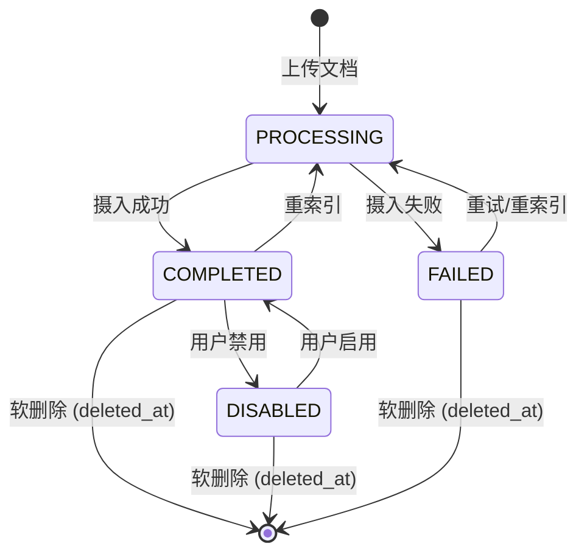
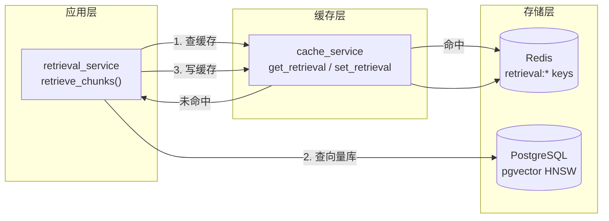

# P2-05 - 数据库与缓存设计

> P2 阶段数据库改动（最小化，仅扩展常量 + 新增 cache layer）和 Redis 缓存策略。

## 1. 数据库改动总览

| 变更类型 | 对象 | 说明 |
|---------|------|------|
| 常量新增 | KbDocument status | 新增 `DOC_STATUS_DISABLED = 3` |
| 索引新增 | kb_qa_records | 新增 `left(question, 50)` 表达式索引（可选，加速高频问题聚合） |
| 无新表 | - | P2 不需要新增数据库表 |

## 2. Model 改动

### 2.1 KbDocument status 常量扩展

```python
# backend/app/models/document.py
DOC_STATUS_FAILED = 0       # 摄入失败
DOC_STATUS_PROCESSING = 1   # 摄入处理中
DOC_STATUS_COMPLETED = 2    # 摄入完成，可检索
DOC_STATUS_DISABLED = 3     # ★ NEW: 人工禁用，切片保留但检索跳过
```

**状态转换图:**


### 2.2 检索过滤逻辑更新

`retrieval_service.retrieve_chunks()` 需加上对 `DOC_STATUS_DISABLED` 的过滤:

```python
.where(
    KbDocument.deleted_at.is_(None),
    KbDocument.status == DOC_STATUS_COMPLETED,  # 已有，天然过滤了 DISABLED
    ...
)
```

无需改动，因为当前 filter 已限定 `status == DOC_STATUS_COMPLETED`，`DISABLED(3)` 会被自动排除。

## 3. 可选索引优化

```sql
-- 加速高频问题统计的 GROUP BY LEFT(question, 50) 查询
-- 仅在 Q&A 记录超过 10000 条时建议创建
CREATE INDEX IF NOT EXISTS idx_qa_question_prefix 
ON kb_qa_records (LEFT(question, 50));
```

当前数据量预计在千级别，暂时不需要此索引。在 `findings.md` 中记录为未来优化点。

## 4. Redis 缓存设计

### 4.1 架构



### 4.2 Key 规范

| Pattern | 类型 | TTL | 说明 |
|---------|------|-----|------|
| `retrieval:{md5hash}` | String (JSON) | 3600s | 检索结果缓存，key = md5(query_embedding_bytes) |
| `retrieval:*` | - | - | 文档禁用/重索引/切片变更时批量清除 |

### 4.3 缓存数据结构

```json
// Redis value (String, JSON encoded)
[
  {
    "chunk_id": 42,
    "doc_name": "系统架构设计手册.md",
    "content": "微服务间通过 gRPC 进行同步通信...",
    "similarity": 0.92,
    "page": 3
  },
  {
    "chunk_id": 107,
    "doc_name": "运维手册.md",
    "content": "服务部署采用 Docker Compose 编排...",
    "similarity": 0.85,
    "page": null
  }
]
```

### 4.4 缓存失效策略

| 触发事件 | 清除范围 | 方式 |
|---------|---------|------|
| 文档上传 | 全部 `retrieval:*` | FLUSHALL by pattern (SCAN + DEL) |
| 文档重索引 | 全部 `retrieval:*` | FLUSHALL by pattern |
| 文档禁用/启用 | 全部 `retrieval:*` | FLUSHALL by pattern |
| 切片编辑 | 全部 `retrieval:*` | FLUSHALL by pattern |
| 切片删除 | 全部 `retrieval:*` | FLUSHALL by pattern |
| TTL 过期 | 单 key | Redis 自动过期 |

**设计理由**: P2 知识库规模在万级切片以内，全量清除检索缓存的成本远低于精确清除的复杂度。当知识库达到十万级时 (P3)，可改为精准清除相关文档的缓存。

### 4.5 降级策略

```python
async def retrieve_chunks(db, query_embedding, ...):
    try:
        cached = await cache_service.get_retrieval(redis, query_hash)
        if cached:
            return cached
    except Exception:
        logger.warning("Redis 缓存读取失败，降级到直接查询")
    
    chunks = await _pgvector_retrieve(db, query_embedding, ...)
    
    try:
        await cache_service.set_retrieval(redis, query_hash, chunks)
    except Exception:
        logger.warning("Redis 缓存写入失败")
    
    return chunks
```

Redis 不可用时自动降级到直接查询 pgvector，不影响核心问答功能。

### 4.6 Redis 连接管理 (`core/redis.py`)

```python
import redis.asyncio as aioredis
from app.config import settings

async def get_redis() -> aioredis.Redis:
    """获取 Redis 连接"""
    return aioredis.from_url(settings.REDIS_URL, decode_responses=True)
```

FastAPI 依赖注入可选: 由于检索服务调用频率高，建议在 `retrieval_service` 内部直接管理连接，而非通过 FastAPI Depends。

### 4.7 环境变量扩展

```bash
# .env 新增（均在 config.py Settings 中）
REDIS_URL=redis://localhost:6379          # 已有，无需改动
REDIS_CACHE_TTL=3600                      # ★ NEW: 缓存过期时间（秒）
REDIS_CACHE_ENABLED=true                  # ★ NEW: 缓存开关（可运维关闭）
```

## 5. 数据库迁移脚本

```sql
-- Alembic revision: P2_add_doc_status_disabled
-- 无需改表结构，仅增加注释文档说明 status=3 的语义

COMMENT ON COLUMN kb_documents.status IS '0:failed 1:processing 2:completed 3:disabled';
```

**迁移策略**: P2 不修改数据库 schema（无新表、无新列、无改列类型），仅通过代码中的常量定义新增 status=3 语义。Alembic 迁移仅添加列注释，保证可逆。

## 6. 数据一致性保障

| 操作 | 事务范围 | 回滚策略 |
|------|---------|---------|
| 文档重索引 | 删除 chunks + 写入新 chunks 在同一事务 | 全部回滚，文档状态恢复为 FAILED |
| 切片编辑 | 单条 UPDATE + 重新 embedding | 嵌入失败回滚 content 修改 |
| 切片删除 | 单条 DELETE + 更新 chunk_count | 同一事务 |
| Redis 缓存写入 | 不在事务内 | 写入失败仅日志告警，不影响业务 |
